# Fury In Motion: Visualizing U.S. Tornadoes

> *“The storm never lasts forever. Bad weeks come and go. You can't control the wind—but you can control your sail.”*

<p align="center">
  
  
  
    <a href="https://furyinmotion.streamlit.app/">
        
      </a>
</p>

---

## 🚀 Project Overview

**Fury In Motion** is an interactive scientific visualization platform that explores U.S. tornado data through dynamic maps, statistical analysis, and weather integration.  
We aim to help users:

- Analyze historical tornado events (1950–2023).
- Explore how tornado severity correlates with environmental and demographic factors.
- Investigate patterns in tornado behavior over time.

This project was developed as part of a scientific visualization course.

---

## 🎯 Project Goals

- **General Goals:**
  - Display tornado data in an engaging and informative format.
  - Use multiple forms of visualization to communicate complex patterns effectively.
  - Cover a large time span to uncover long-term trends.

- **Scientific Goals:**
  - **Munshi:** Visualize and compare the top 10–50 most impactful tornadoes based on path length, width, fatalities, and injuries, integrating historical weather conditions.
  - **Sam:** Incorporate NOAA weather station data to explore meteorological influences on tornado frequency and distribution.
  - **Matthew:** Investigate the relationship between county population sizes and tornado damage (fatalities and injuries).

---

## 📚 Background

- **Primary Dataset:**  
  NOAA's US Tornado Database (1950–2023).

- **Supplementary Data:**
  - NOAA Weather Stations (precipitation, temperature, etc.).
  - Open-Meteo Weather API (historical hourly/daily weather).
  - U.S. Census Bureau County Population Estimates (2023).
  - TIGER Line Shapefiles for county boundaries.

- **Scientific Context:**  
  We consulted academic and meteorological resources to hypothesize and validate relationships between atmospheric conditions and tornado severity.

---

## 🗺️ Project Components

- **Top-N Tornado Explorer:**  
  Visualizes the most impactful tornadoes colored by EF rating, with weather-enriched start/end popups.

- **Scientific Question Explorer:**  
  Explores relationships between tornado metrics and weather variables (e.g., temperature vs. path length, wind speed vs. fatalities).

- **Meteorological Trends Over Time:**  
  Investigates how tornado frequency and intensity vary across seasons and decades using weather station data.

- **Demographic Impact Map:**  
  Interactive choropleth showing county populations overlaid with tornado damage indicators.

---

## 🛠️ Implementation Details

- **Framework:** Python + Streamlit
- **Main Libraries:**
  - Folium (Geospatial maps)
  - Plotly (Interactive plots and radar charts)
  - GeoPandas (Geographical data processing)
  - PyDeck (Stacked geo bar charts)
  - TQDM, Seaborn, Pandas, NumPy, Shapely

- **Architecture:**

```bash
/data                # Tornado datasets, GeoJSONs
/cache               # Prefetched weather data (weather_cache.json)
/utils               # Data loading and processing utilities
/components          # Visualization modules
/science_questions   # Scientific exploration scripts
app.py               # Main Streamlit app
```
- - **Caching Strategy:**  
  Used local caching of weather API responses to ensure faster rendering and reproducibility.

---

## 📈 Scientific Highlights

- Most severe tornadoes (by fatalities and width) cluster heavily in the Southeast and Midwest.
- Higher surface temperatures did **not** strongly correlate with longer tornado paths.
- Surface wind gusts showed **weak** correlation with fatalities.
- Precipitation levels had **minimal** correlation with tornado width.

These results challenge common assumptions and highlight the complex, multifactorial nature of tornado impacts.

---

## 🧠 Key Learnings

- Data-driven validation is essential—hypotheses often fail under empirical scrutiny.
- API-based data enrichment introduces reproducibility and scaling challenges.
- Balancing interactivity and clarity in visualizations is critical to avoid overwhelming users.
- Visual analytics such as correlation matrices and radar charts can reveal or debunk assumed patterns.

---

## 🛠️ How to Run

1. Clone the repository:

```bash
git clone https://github.com/munshisaifuzzaman/Fury-In-Motion.git
```
2. Navigate to the project directory:
```bash
cd Fury-In-Motion
```
3. Launch the Streamlit app:
```bash
streamlit run app.py
```

---


## 🔗 Code Repository

- **GitHub Repository:** [Fury-In-Motion](https://github.com/munshisaifuzzaman/Fury-In-Motion)
- **Live Demo:** *Coming Soon!* 🚀

---

## ✨ Future Work

- Add financial damage data from insurance datasets.
- Expand to visualize other natural disasters (e.g., hurricanes, wildfires).
- Enhance user interactivity with dynamic filters and expanded weather layers.

---

## 👥 Authors

- **Munshi Saifuzzaman** – Weather-driven scientific exploration
- **Sam** – Temporal analysis and meteorological trends
- **Matthew** – Demographic and spatial analysis

---

## 📸 Sample Visuals

### From Munshi Saifuzzaman's exploration of the top N most impactful tornadoes: 
<p align="center">
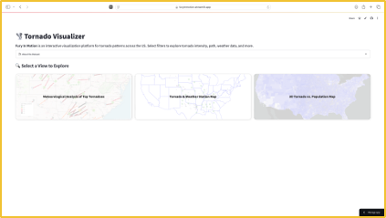
  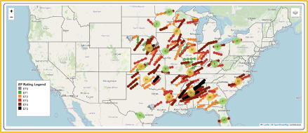
  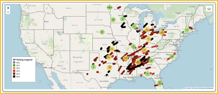
  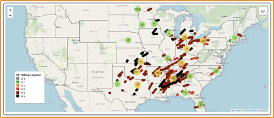
  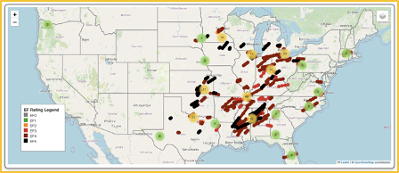
  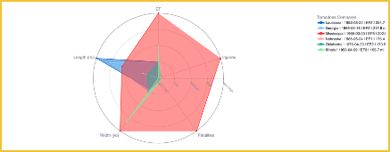
  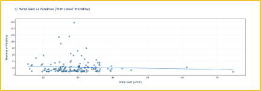
  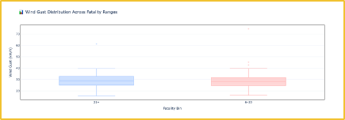
  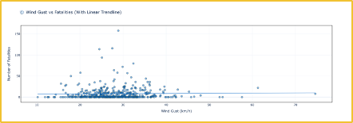
  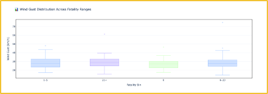
  
  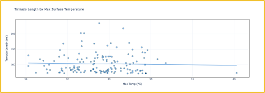
  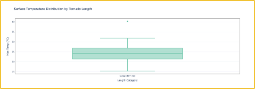
  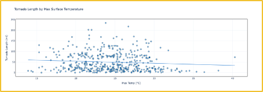
  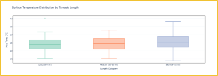
  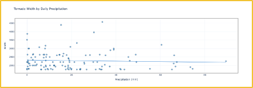
  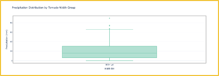
  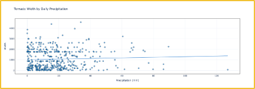
  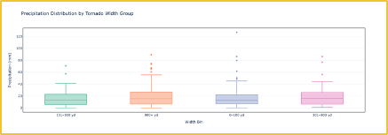
  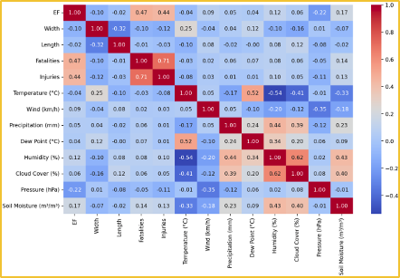
  
</p>

### From Sam's exploration of tornado frequency and intensity over time: 
<p align="center">
  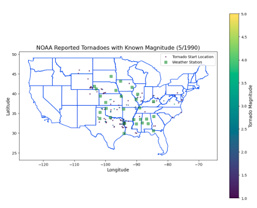
  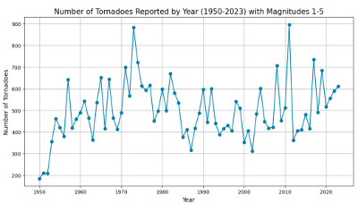
</p>

### From Matthew's exploration of tornado damage and population density:
<p align="center">
  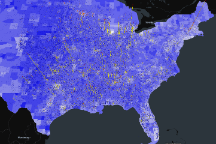
</p>
---